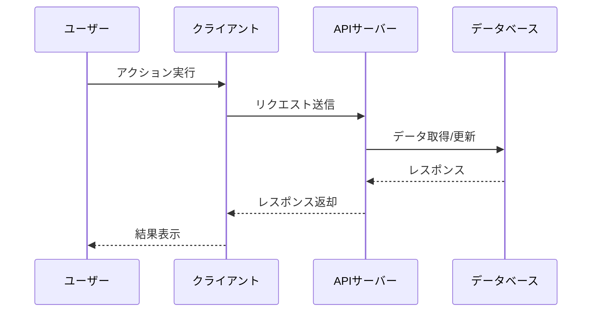

# ⚠️ このコマンドは非推奨です（Deprecated）

このコマンドは役割ごとに細分化された新しいコマンドに置き換えられました。
以下の新しいワークフローを使用してください：

## 新しいワークフロー

### 1. ステアリングドキュメント作成（初回のみ）
```
/sdd:steering
```
プロジェクト全体の永続的なコンテキスト（プロダクト方針、技術スタック、プロジェクト構造）を作成

### 2. タスクの初期化
```
/sdd:init-task <計画の説明>
```
タスクスケルトンを作成（research.md, overview.md）

### 3. 要件と技術詳細の定義
```
/sdd:define-requirements <taskname>
/sdd:define-technical <taskname>
```
要件仕様と技術詳細を生成

### 4. 調査と検証
```
/sdd:conduct-research <taskname>
/sdd:validate-feasibility <taskname>
/sdd:contradiction-check <taskname>
```
技術調査を実施し、実現可能性を検証

### 5. Phase構成の決定
```
/sdd:plan-phases <taskname>
```
調査完了後、Phase構成をoverview.mdに追加

### 6. Phase詳細計画の作成
```
/sdd:breakdown-phase <taskname> <phase番号>
```
各Phaseの詳細タスク計画を作成

---

# [非推奨] 計画をもとにプロジェクトの全容ドキュメント、技術詳細、仕様書を生成します

**⚠️ このコマンドは非推奨です。上記の新しいワークフローを使用してください。**

以下の計画に基づいて、specs/[taskname]/配下に包括的な仕様書ドキュメントを作成してください。

**注意**: Phase別計画書の生成・管理には `/sdd:breakdown-phase` コマンドを使用してください。

【計画内容】
$ARGUMENTS

- **重要**: 不明なところは勝手に決めずに「**不明**」と明記し、複数の案（案A、案B、案Cなど）を記述すること。ユーザーは `/clarify-spec [taskname]` コマンドで不明箇所を明確化できる

## 実行手順

### 0. 引数チェックとモード判定
1. `$ARGUMENTS` が空の場合：
   - `specs/` ディレクトリ配下の既存タスク一覧（ディレクトリ名）を取得
   - タスクが存在する場合、AskUserQuestionツールで「どのタスクに着手しますか？」と質問し、選択させる
   - タスクが存在しない場合、「specs/配下にタスクがありません。計画内容を入力してください」とユーザーに伝える
   - 選択されたタスクは既存のため、自動的に**チェック＆更新モード**となり、手順1-3をスキップして直接ドキュメントのチェック＆更新を実施

2. `$ARGUMENTS` が指定されている場合：
   - 手順1（モード判定）へ進む

### 1. モード判定（arguments指定時のみ）
1. タスク名を特定（引数から、または計画内容から生成）
2. `specs/[taskname]/` ディレクトリの存在を確認
3. モードを決定：
   - **新規作成モード**: ディレクトリが存在しない → 手順2から実行
   - **チェック＆更新モード**: ディレクトリが既に存在 → 既存ファイルをこのコマンドの基準（下記の作成するドキュメントのテンプレート）に沿ってチェックし、不足・違反があれば修正して更新

### 2. タスク名の生成
上記の計画内容から適切なタスク名（ディレクトリ名）を生成してください：
- プロジェクト内容を端的に表す英数字とハイフンのみの名前
- 例: `user-authentication`, `payment-integration`, `admin-dashboard`, `api-v2-migration`
- 生成したタスク名をユーザーに提示し、確認を取る

### 3. 非機能要件の確認
以下の非機能要件について、ユーザーに必要かどうかを確認してください：

- **パフォーマンス要件**: レスポンスタイム、同時接続数、データ処理量など
- **可用性要件**: 稼働率目標、ダウンタイム許容範囲、障害復旧時間など
- **保守性要件**: コード品質基準、ドキュメント要件、技術的負債の管理など
- **ユーザビリティ要件**: UI/UX要件、アクセシビリティ、多言語対応など
- **制約条件**: 技術的制約、ビジネス的制約、法的・規制上の制約など
- **テスト戦略**: テストの種類、カバレッジ目標など
- **開発環境**: 必要なツール、セットアップ手順など

AskUserQuestionツールを使用して、これらの要件が必要かどうかをユーザーに確認すること。
セキュリティ要件は常に含めるため、確認不要。

### 4. ディレクトリの確認と作成
1. 現在のディレクトリに `specs/` フォルダが存在するか確認
2. 存在しない場合は、ユーザーに「specs/ フォルダを作成してもよろしいですか？」と確認
3. 確認が取れたら `specs/[taskname]/` ディレクトリを作成（[taskname]は生成したタスク名）

### 5. 作成するドキュメント

以下のドキュメントを `specs/[taskname]/` ディレクトリ内に作成してください：

#### 📄 1. research.md - 調査項目リスト
プロジェクトの実装前に調査・検証が必要な項目をリスト化

```markdown
# 調査項目リスト

このドキュメントでは、プロジェクトのPhase分けと実装を開始する前に調査・検証が必要な項目を管理します。

**⚠️ 重要**: Phase分けは、このドキュメントの全ての調査項目が完了した後に実施してください。

## 調査ステータス
- **全体ステータス**: 未着手/調査中/完了
- **調査完了項目数**: 0 / {総数}

## 調査項目

### 調査項目1: [調査項目名]
- **カテゴリ**: 技術選定/アーキテクチャ/実装方法/パフォーマンス/セキュリティ/その他
- **ステータス**: 未着手/調査中/完了
- **優先度**: High/Medium/Low
- **調査内容**:
  - 何を調査するのか具体的に記述
- **調査方法**:
  - どのように調査するか（PoC作成、ベンチマーク、ドキュメント調査など）
- **判断基準**:
  - 何を基準に判断するか
- **調査結果**: （調査完了後に記入）
- **結論**: （調査完了後に記入）
- **影響範囲**: この調査結果が影響するPhaseや機能

### 調査項目2: [調査項目名]
...

## 調査完了後のチェックリスト
- [ ] 全ての調査項目が完了している
- [ ] 調査結果がoverview.md、specification.md、technical-details.mdに反映されている
- [ ] 技術的な不確実性が解消されている
- [ ] Phase分けに必要な情報が揃っている

**調査完了後**: `/sdd:break-down-phase [taskname]` コマンドでPhase別計画書を作成できます
```

#### 📄 2. overview.md - 全容ドキュメント
プロジェクト全体の概要を記述

```markdown
# プロジェクト全容ドキュメント

## プロジェクト概要
- プロジェクト名
- 目的と背景
- 主要な目標

## プロジェクトステータス
- **ステータス**: 未着手/進行中/完了/却下

## スコープ
- 対象範囲
- 対象外の範囲

## 主要機能
- 機能一覧と概要

## Phase概要と依存関係

### Phase 1: {phaseName}
- **開始日時**: YYYY-MM-DD HH:MM（未着手の場合は空欄）
- **状態**: 未着手/進行中/完了
- **目標**:
- **依存関係**: なし（または前提となるphase）
- **成果物**:

### Phase 2: {phaseName}
- **開始日時**: YYYY-MM-DD HH:MM（未着手の場合は空欄）
- **状態**: 未着手/進行中/完了
- **目標**:
- **依存関係**: Phase 1の完了が必須
- **成果物**:

### Phase 3: {phaseName}
- **開始日時**: YYYY-MM-DD HH:MM（未着手の場合は空欄）
- **状態**: 未着手/進行中/完了
- **目標**:
- **依存関係**: Phase 2の〇〇機能の完了が必須
- **成果物**:

※各Phaseの詳細計画書は `/sdd:break-down-phase` コマンドで生成してください

**タスク番号形式について:**
- Phase内のタスクは番号で管理されます
- 並列実行するタスクはn.x形式（例: 2.1, 2.2, 2.3）で番号付けされます
- 単一番号のタスク（例: 1, 3）は前のタスクグループ完了後に実行されます

## Phase依存関係図
```
Phase 1 (Foundation)
    ↓
Phase 2 (Core Features)
    ↓
Phase 3 (Advanced Features)
    ↓
Phase 4 (Optimization & Launch)
```

## シーケンス図
主要な機能のシーケンス図をMermaid記法で記述してください。



複数の主要機能がある場合は、機能ごとにシーケンス図を作成してください。

## 成果物
- 最終的な成果物一覧

## リスクと制約
- 想定されるリスク
- 技術的/ビジネス的制約
```

#### 📄 3. specification.md - 詳細仕様書
機能要件と非機能要件の詳細を記述

```markdown
# 詳細仕様書

## 機能要件

### 機能1: [機能名]
- **概要**: 機能の説明
- **優先度**: High/Medium/Low
- **実装Phase**: Phase N
- **ユースケース**:
  - アクター:
  - 前提条件:
  - 基本フロー:
  - 代替フロー:
  - 事後条件:
- **入力**:
- **出力**:
- **ビジネスルール**:
- **バリデーション**:

### 機能2: [機能名]
...

## 非機能要件

### セキュリティ
- 認証・認可要件
- データ暗号化
- 監査ログ

### パフォーマンス（ユーザー指定時のみ）
- レスポンスタイム要件
- 同時接続数
- データ処理量

### 可用性（ユーザー指定時のみ）
- 稼働率目標
- ダウンタイム許容範囲
- 障害復旧時間

### 保守性（ユーザー指定時のみ）
- コード品質基準
- ドキュメント要件
- 技術的負債の管理

### ユーザビリティ（ユーザー指定時のみ）
- UI/UX要件
- アクセシビリティ
- 多言語対応

## データ要件
- データモデル概要
- データ保持期間
- データ移行要件

## インターフェース要件
- 外部システム連携
- API仕様概要
- データフォーマット

## 制約条件（ユーザー指定時のみ）
- 技術的制約
- ビジネス的制約
- 法的・規制上の制約
```

#### 📄 4. technical-details.md - 技術詳細
技術的な仕様と設計を記述

```markdown
# 技術詳細ドキュメント

## アーキテクチャ
- システム構成図
- 技術スタック
- インフラ構成

## 技術選定
- 採用技術とその理由
- 代替案との比較

## データ設計
- データモデル
- データベーススキーマ
- データフロー

## API設計
- エンドポイント一覧
- リクエスト/レスポンス仕様
- 認証・認可

## セキュリティ
- セキュリティ要件
- 実装方針

## パフォーマンス要件（ユーザー指定時のみ）
- レスポンスタイム
- スループット

## 開発環境（ユーザー指定時のみ）
- 必要なツール
- セットアップ手順

## テスト戦略（ユーザー指定時のみ）
- テストの種類
- カバレッジ目標
```

### 6. ドキュメント生成時の注意点

#### 基本原則
- **⚠️ 重要**: 詳細であれば詳細であるほど良いわけではない。必要な部分だけを必要なだけ書くこと
- **⚠️ 重要**: 推測される開発期間、工数、見積もり時間などは一切記載しないこと
- **⚠️ 重要**: 「将来的に必要になる」「今後〜が必要」といった適当な推測に基づいた記述は禁止。現時点で明確に必要なことのみを記載すること
- 各ドキュメントは相互に整合性を保つこと
- 具体的で実行可能な内容にすること
- 依存関係は明確かつ具体的に記述すること（「Phase 1完了後」ではなく「Phase 1の認証機能実装完了後」など）
- プロジェクトステータスは以下のいずれかを使用: 未着手/進行中/完了/却下
- Phase状態は以下のいずれかを使用: 未着手/進行中/完了
- 開始日時は作業開始時に記録（未着手の場合は空欄のまま）
- 必要に応じてダイアグラムや図表を含めること
- マークダウン形式で読みやすく整形すること
- phase数とphase名はプロジェクトの規模と内容に応じて適切に設定すること
- specification.mdは機能要件の詳細を、technical-details.mdは技術実装の詳細を記述し、役割を明確に分離すること

#### research.mdと「**不明**」の使い分け

**research.md（調査項目リスト）に記載すべき項目**:
- **技術的な調査・検証が必要な項目**
- AIが自律的に調査・実験・ベンチマークなどを行って判断できるもの
- 例：
  - ✅ 「JWT認証とセッション認証のパフォーマンス比較」
  - ✅ 「PostgreSQLとMySQLのベンチマーク」
  - ✅ 「リアルタイム通信の実装方法（WebSocket vs SSE）の検証」
  - ✅ 「画像アップロード機能の実装可能性調査」
- `/sdd:conduct-research` コマンドでAIが調査を実施

**「**不明**」として記載すべき項目**:
- **ビジネス要件やユーザーの意思決定が必要な項目**
- AIだけでは判断できず、ユーザー（プロダクトオーナー、ステークホルダー）への確認が必要なもの
- 例：
  - ✅ 「ログイン時にメールアドレスとユーザー名のどちらを使うか」
  - ✅ 「管理者画面の公開範囲（社内のみ or 顧客も使用）」
  - ✅ 「エラー発生時にメール通知を送るか」
  - ✅ 「削除機能は論理削除か物理削除か」
- 不明箇所は複数の案（案A、案B、案Cなど）を記述
- `/sdd:clarify-spec` コマンドでユーザーに質問して明確化

**判断基準**:
- 「AIが技術的に検証・比較できる」→ research.md
- 「ユーザーの意思決定が必要」→ 「**不明**」

### 7. 完了報告
すべてのドキュメント作成後、以下を報告：
- 作成したディレクトリパス: `specs/[taskname]/`
- 作成したファイルのリスト
- 各ドキュメントの概要
- Phase間の依存関係のサマリー
- 不明箇所の数（「**不明**」と記載した箇所）
- 調査項目の数
- 次のアクション（推奨順）:
  1. **技術調査**: `/sdd:conduct-research [taskname]` で技術的な調査項目を実施
  2. **ビジネス要件の確認**: `/sdd:clarify-spec [taskname]` で不明箇所をユーザーに確認
  3. **Phase分け**: 調査と確認が完了したら `/sdd:break-down-phase [taskname]` でPhase別計画書を生成

  ⚠️ **重要**: Phase分けは調査と確認が全て完了してから実施してください
