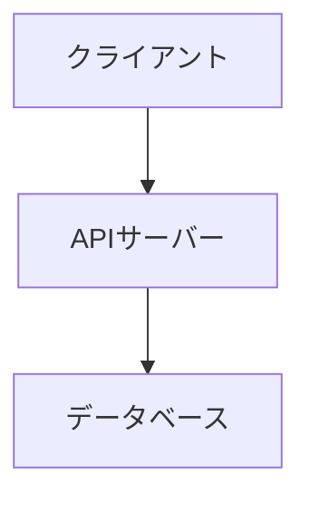
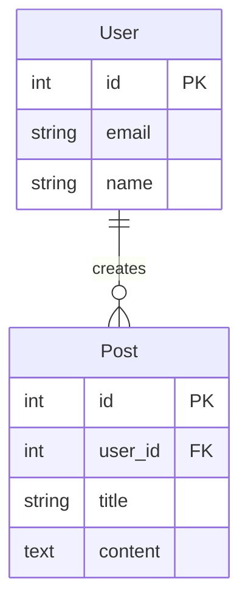

# 技術詳細ドキュメントを作成します

タスクの技術仕様とアーキテクチャ設計を詳細化し、`technical-details.md` を生成します。

【対象タスク名】
$ARGUMENTS

## 実行手順

### 0. ステアリングドキュメントの読み込み

以下のステアリングドキュメントを読み込み、プロジェクトの技術標準を把握：

- `specs/_steering/tech.md` - **最重要**: 技術スタック、アーキテクチャパターン、開発標準
- `specs/_steering/structure.md` - プロジェクト構造、命名規則
- `specs/_steering/product.md` - プロダクト方針

**ステアリングドキュメントが存在しない場合**:
- 警告メッセージを表示: 「⚠️ ステアリングドキュメントが見つかりません。先に `/sdd:steering` を実行することを推奨します。」

**重要**: tech.mdに記載されている技術スタックとアーキテクチャパターンを**必ず尊重**してください。

### 1. タスクディレクトリの確認

タスク名が指定されている場合:
- `specs/[taskname]/` ディレクトリの存在を確認
- `specs/[taskname]/overview.md` および `specs/[taskname]/specification.md` が存在するか確認

タスク名が指定されていない場合:
- `specs/` ディレクトリ内の利用可能なタスクをリスト表示
- **AskUserQuestionツールを使用**してどのタスクについて作業するかユーザーに選択を求める

### 2. 既存ドキュメントの読み込み

以下のドキュメントを読み込み、技術詳細化に必要な情報を抽出：

- `specs/[taskname]/overview.md` - プロジェクト概要、主要機能
- `specs/[taskname]/specification.md` - 機能要件、データ要件、インターフェース要件
- `specs/_steering/tech.md` - **既存の技術スタック、アーキテクチャパターン**
- `specs/_steering/structure.md` - コード構造、命名規則

### 3. technical-details.mdの生成

`specs/[taskname]/technical-details.md` を生成：

```markdown
# 技術詳細ドキュメント

## アーキテクチャ

### システム構成図
[Mermaid記法でシステム構成を図示]



### 技術スタック

**重要**: 以下は `specs/_steering/tech.md` に準拠しています。

#### 言語・ランタイム
- **言語**: [steering/tech.mdから取得]
- **ランタイム**: [steering/tech.mdから取得]
- **フレームワーク**: [steering/tech.mdから取得]

#### 主要ライブラリ
[steering/tech.mdのKey Dependencies/Librariesを参照]

このタスク固有の追加ライブラリ:
- [タスク固有のライブラリ]

### インフラ構成
[デプロイ環境、インフラ構成]

## 技術選定（タスク固有の技術のみ）

**注意**: steering/tech.md で既に定義されている技術については記載不要です。このタスク固有の技術選定のみ記載してください。

#### [技術名]（必要な場合のみ）
- **採用理由**: [1-2行で簡潔に]
- **steering/tech.mdとの関係**: [準拠/逸脱の明記]

技術選定が不要な場合: 「steering/tech.mdの標準技術を使用」と記載

## データ設計

### データモデル

[specification.mdのデータ要件を具体的なスキーマに変換]

#### エンティティ図



### データベーススキーマ

**重要**: steering/tech.md で定義されているデータベース技術を使用

#### [テーブル1]
```sql
CREATE TABLE users (
    id SERIAL PRIMARY KEY,
    email VARCHAR(255) UNIQUE NOT NULL,
    name VARCHAR(100) NOT NULL,
    created_at TIMESTAMP DEFAULT CURRENT_TIMESTAMP
);
```

### データフロー
[データの流れを図示]

## API設計

### エンドポイント一覧

**命名規約**: steering/structure.md の規約に準拠

| メソッド | パス | 説明 | 入力 | 出力 |
|---------|------|------|------|------|
| GET | /api/users | ユーザー一覧取得 | クエリパラメータ | User[] |
| POST | /api/users | ユーザー作成 | UserInput | User |
| GET | /api/users/:id | ユーザー詳細取得 | id | User |
| PUT | /api/users/:id | ユーザー更新 | id, UserInput | User |
| DELETE | /api/users/:id | ユーザー削除 | id | 成功/失敗 |

### リクエスト/レスポンス仕様（必要な場合のみ）

複雑なAPI仕様がある場合のみ詳細を記載。標準的なCRUD操作の場合は省略可。

#### [エンドポイント名]（必要な場合のみ）
- **入力**: [JSON例]
- **出力**: [JSON例]
- **エラー**: [エラーコード一覧]

### 認証・認可

**重要**: steering/tech.md のセキュリティ要件に準拠

- **認証方式**: [JWT/Session/OAuth2 - steering/tech.mdから]
- **認可方式**: [RBAC/ABAC]
- **トークン管理**: [保存場所、有効期限]

## セキュリティ

**重要**: specification.md および steering/tech.md のセキュリティ要件に準拠

### セキュリティ要件
[specification.mdから取得]

### 実装方針
- **認証**: [実装方法]
- **認可**: [実装方法]
- **データ暗号化**: [実装方法]
- **監査ログ**: [実装方法]

## パフォーマンス要件（ユーザー指定時のみ）

[specification.mdで指定された場合のみ含める]

- **レスポンスタイム**: [目標値と測定方法]
- **スループット**: [目標値と測定方法]
- **最適化方針**: [具体的な最適化手法]

## 開発環境（ユーザー指定時のみ）

**重要**: steering/tech.md の開発環境に準拠

### 必要なツール
[steering/tech.md の Required Tools を参照]

このタスク固有の追加ツール:
- [タスク固有のツール]

### セットアップ手順
```bash
# 1. 依存関係のインストール
[コマンド]

# 2. 環境変数の設定
[コマンド]

# 3. データベースのセットアップ
[コマンド]

# 4. 開発サーバーの起動
[コマンド]
```

## テスト戦略（ユーザー指定時のみ）

**重要**: steering/tech.md のテスト標準に準拠

### テストの種類
- **単体テスト**: [フレームワーク、カバレッジ目標]
- **統合テスト**: [範囲、実行タイミング]
- **E2Eテスト**: [ツール、シナリオ]

### カバレッジ目標
[steering/tech.md から取得、またはタスク固有の目標]
```

**生成時の注意点**:
- **⚠️ 最重要**: steering/tech.md に記載されている技術スタックを**必ず使用**すること
- **⚠️ 重要**: steering/tech.md から逸脱する場合は、明確な理由を記述すること
- **⚠️ 重要**: steering/structure.md の命名規約、コード構造に準拠すること
- **⚠️ 重要**: 詳細であれば詳細であるほど良いわけではない。必要な部分だけを必要なだけ書くこと
- 不明なところは勝手に決めずに「**不明**」と明記し、複数の案（案A、案B、案Cなど）を記述すること
- specification.mdは機能要件の詳細を、technical-details.mdは技術実装の詳細を記述し、役割を明確に分離すること

### 4. 完了報告

```
✅ 技術詳細ドキュメントを作成しました
━━━━━━━━━━━━━━━━━━━━━━━━━━━━━━━━━━
📍 作成先: specs/[taskname]/technical-details.md
📝 エンドポイント数: [N]件

💡 次のアクション:
   - Phase計画: `/sdd:plan-phases [taskname]`
   - 不明点の明確化: `/sdd:clarify-spec [taskname]`
━━━━━━━━━━━━━━━━━━━━━━━━━━━━━━━━━━
```

## 注意事項

- **⚠️ 最重要**: steering/tech.md を必ず参照し、プロジェクトの技術標準に準拠すること
- steering/tech.md から逸脱する場合は、明確な理由と承認を得ること
- specification.mdとの役割分担を明確にする（機能要件 vs 技術実装）
- 不明なところは勝手に決めずに「**不明**」と明記すること

## 内部品質チェック

**重要**: 以下のチェックはコマンド内部で実施し、**生成されるspecファイルには結果を記載しません**。

### ステアリングドキュメントレビュー（内部処理）

ドキュメント生成後、内部的にステアリングドキュメントとの整合性を確認：
- tech.mdの技術スタックとの整合性（最重要）
- structure.mdの構造規約との整合性
- product.mdのビジネス目標との整合性

問題がある場合のみユーザーに修正を促す。準拠している場合は何も出力しない。

### 矛盾チェック（内部処理）

ドキュメント生成後、内部的に仕様書間の矛盾を確認：
- specification.mdとtechnical-details.mdのデータ設計の整合性
- API設計と機能要件の整合性
- データモデルとAPI仕様の整合性

矛盾がある場合のみユーザーに警告を表示。問題がなければ何も出力しない。
