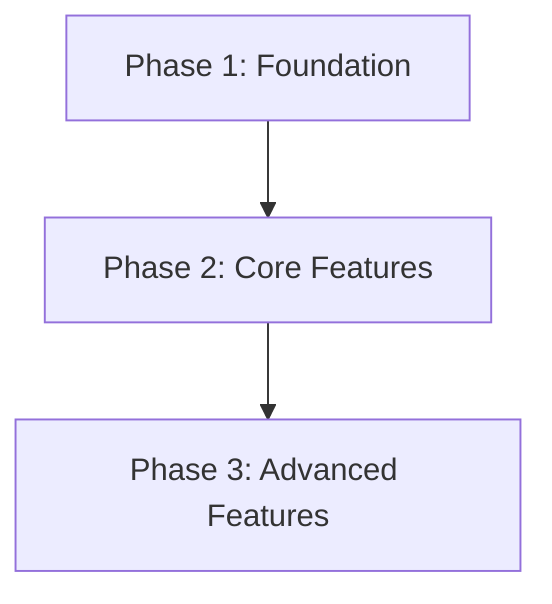
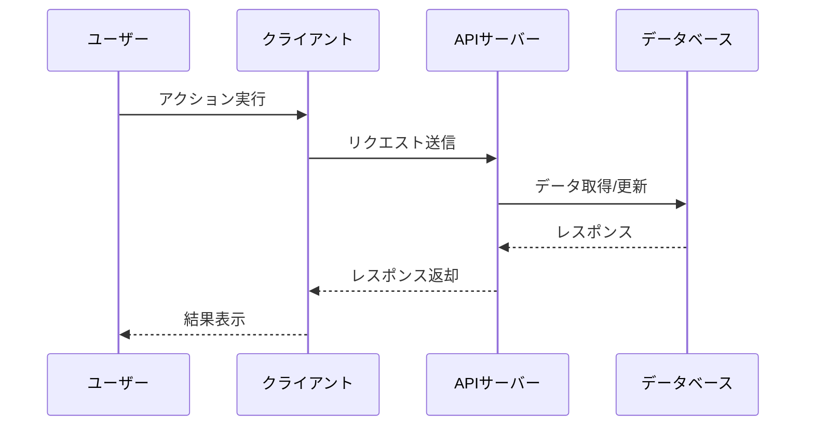

# Phase構成を決定します

調査完了後に、タスクをPhaseに分割する構成を決定し、`overview.md` に追加します。

**重要**: このコマンドは詳細なタスク分解を行いません。Phase構成（Phase数、名前、目標、依存関係）のみを決定します。

【対象タスク名】
$ARGUMENTS

## 実行手順

### 0. ステアリングドキュメントの読み込み

以下のステアリングドキュメントを読み込み、プロジェクトのコンテキストを把握：

- `specs/_steering/product.md` - ビジネス目標、優先順位
- `specs/_steering/tech.md` - 技術スタック、アーキテクチャパターン
- `specs/_steering/structure.md` - プロジェクト構造

### 1. タスクディレクトリの確認

タスク名が指定されている場合:
- `specs/[taskname]/` ディレクトリの存在を確認
- 必須ファイルの存在確認:
  - `overview.md`
  - `research.md`
  - `specification.md`
  - `technical-details.md`

タスク名が指定されていない場合:
- `specs/` ディレクトリ内の利用可能なタスクをリスト表示
- **AskUserQuestionツールを使用**してどのタスクについて作業するかユーザーに選択を求める

### 2. 調査完了の確認

Phase分けを開始する前に、必ず調査が完了していることを確認:

1. **research.mdの読み込みと確認**
   - `specs/[taskname]/research.md` を読み込み
   - 「全体ステータス」を確認

2. **調査ステータスの判定**
   - ステータスが「完了」の場合: 次のステップへ進む
   - ステータスが「完了」でない場合:
     - 警告メッセージを表示: 「⚠️ 調査が完了していません」
     - 未完了の調査項目をリスト表示
     - **AskUserQuestionツールで確認**:
       ```
       調査が完了していませんが、Phase構成の決定を続行しますか？

       未完了の調査項目:
       - [項目1]
       - [項目2]

       選択肢:
       - いいえ（推奨）: `/sdd:conduct-research [taskname]` で調査を完了させてください
       - はい: Phase構成決定を続行（非推奨、後で手戻りが発生する可能性があります）
       ```
     - 「いいえ」の場合: 処理を中断し、調査の完了を促す

### 3. 既存ドキュメントの分析

以下のドキュメントから情報を抽出してPhase構成を決定:

#### research.md
- 調査結果と結論
- 技術選定の決定事項
- 各調査項目の影響範囲

#### specification.md
- 機能要件の詳細
- 各機能の優先度
- 非機能要件

#### technical-details.md
- 技術スタックと技術選定
- データ設計とAPI設計
- セキュリティ要件
- アーキテクチャ構成

#### ステアリングドキュメント
- product.md: ビジネス優先順位、成功指標
- tech.md: 技術的制約、開発標準
- structure.md: プロジェクト構造

### 4. Phase構成の提案

#### Phase分けの基準

以下の基準でPhase構成を提案：

1. **独立してデプロイ・リリース可能な単位**
   - 各Phaseは独立して動作確認とリリースができる状態になる
   - Phase完了時点で品質チェックに成功する状態

2. **機能の依存関係による分割**
   - 後続Phaseが前Phaseの成果物に依存する構造
   - 並行開発可能な機能は明示

3. **リスクとビジネス価値による優先順位付け**
   - 高リスク・高価値の機能は早期のPhaseで実装
   - 基盤機能 → コア機能 → 拡張機能の順に配置

4. **推奨Phase数**: 3-5個
   - 2個以下: 分割が粗すぎる可能性
   - 6個以上: 分割が細かすぎる可能性

#### Phase構成の生成

以下の情報を含むPhase構成を生成：

```markdown
## Phase構成提案

### Phase 1: [Phase名]
- **目標**: [このPhaseで達成すること]
- **依存関係**: なし
- **成果物**:
  - [成果物1]
  - [成果物2]
- **含まれる主要機能**:
  - [機能1]（specification.mdの機能X）
  - [機能2]（specification.mdの機能Y）

### Phase 2: [Phase名]
- **目標**: [このPhaseで達成すること]
- **依存関係**: Phase 1完了
- **成果物**:
  - [成果物1]
  - [成果物2]
- **含まれる主要機能**:
  - [機能3]（specification.mdの機能Z）

### Phase 3: [Phase名]
- **目標**: [このPhaseで達成すること]
- **依存関係**: Phase 2完了
- **成果物**:
  - [成果物1]
- **含まれる主要機能**:
  - [機能4]（specification.mdの機能W）

## Phase依存関係図


```

### 5. ユーザーへの確認

**AskUserQuestionツールを使用**してPhase構成の妥当性を確認：

```
以下のPhase構成でよろしいですか？

[生成したPhase構成を表示]

選択肢:
- 承認（このPhase構成でoverview.mdを更新）
- 修正が必要（Phase数、Phase名、依存関係などを調整したい）
- やり直し（Phase構成を再提案）
```

**「修正が必要」の場合**:
- どの部分を修正したいか質問
- ユーザーの要望に基づいて再提案
- 再度確認

### 6. overview.mdの更新

ユーザーの承認後、`specs/[taskname]/overview.md` に以下のセクションを追加：

```markdown
## Phase概要と依存関係

### Phase 1: [Phase名]
- **開始日時**: （空欄）
- **状態**: 未着手
- **目標**: [目標]
- **依存関係**: なし
- **成果物**:
  - [成果物1]
  - [成果物2]

### Phase 2: [Phase名]
- **開始日時**: （空欄）
- **状態**: 未着手
- **目標**: [目標]
- **依存関係**: Phase 1完了
- **成果物**:
  - [成果物1]
  - [成果物2]

### Phase 3: [Phase名]
- **開始日時**: （空欄）
- **状態**: 未着手
- **目標**: [目標]
- **依存関係**: Phase 2完了
- **成果物**:
  - [成果物1]

**タスク番号形式について:**
- Phase内のタスクは番号で管理されます（`/sdd:breakdown-phase`で生成）
- 並列実行するタスクはn.x形式（例: 2.1, 2.2, 2.3）で番号付けされます
- 単一番号のタスク（例: 1, 3）は前のタスクグループ完了後に実行されます

## Phase依存関係図


## シーケンス図

[主要な機能のシーケンス図をMermaid記法で記述]



複数の主要機能がある場合は、機能ごとにシーケンス図を作成してください。
```

**重要**: 既存のoverview.mdの内容は保持し、上記セクションを追加

### 7. 完了報告

```markdown
✅ Phase構成を決定しました
━━━━━━━━━━━━━━━━━━━━━━━━━━━━━━━━━━
📍 更新先: specs/[taskname]/overview.md

📊 Phase構成:
   - Phase数: [N]個
   - Phase 1: [Phase名] - [目標]
   - Phase 2: [Phase名] - [目標]
   - Phase 3: [Phase名] - [目標]

🔗 Phase依存関係:
   Phase 1 → Phase 2 → Phase 3

💡 次のアクション:
   1. **Phase 1の詳細計画**: `/sdd:breakdown-phase [taskname] 1` でPhase 1の詳細タスク計画を作成
   2. overview.mdの内容を確認・調整してください
   3. Phase構成を変更したい場合は、このコマンドを再実行してください

⚠️ 重要:
   - Phase内の詳細なタスク分解は `/sdd:breakdown-phase [taskname] <phase番号>` で実施します
   - Phase 1の計画が完了してから実装を開始することを推奨します
━━━━━━━━━━━━━━━━━━━━━━━━━━━━━━━━━━
```

## 注意事項

- **⚠️ 重要**: このコマンドは詳細なタスク分解を行いません（Phase構成のみ決定）
- **⚠️ 重要**: 調査が完了していない状態でPhase構成を決定すると、後で大きな手戻りが発生する可能性があります
- **⚠️ 重要**: ステアリングドキュメントを参照し、プロジェクトの方針に準拠してください
- Phase数はプロジェクトの規模と複雑さに応じて柔軟に決定してください（2個でも6個以上でも可）
- 各Phaseは独立してデプロイ・リリース可能な単位にする
- Phase間の依存関係を明確にする

## ステアリングドキュメントレビュー（必須）

Phase構成がステアリングドキュメントに準拠しているか必ず確認してください：

```bash
# steering-reviewer SubAgentを使用
# このSubAgentは指摘のみを行い、修正は行いません
Task(general-purpose): sdd/agents/steering-reviewer.md を読み込んで、specs/[taskname]/overview.md のPhase構成セクションをレビューしてください
```

**レビュー観点**:
- product.md のビジネス目標とPhaseの目標が整合しているか
- tech.md のアーキテクチャ方針とPhase分割が適切か
- structure.md のモジュール境界とPhase境界が適切か
